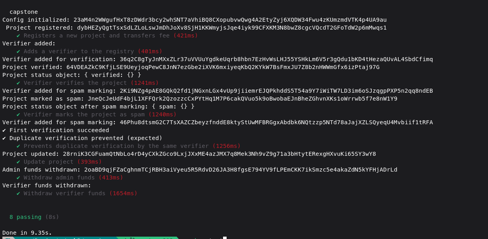
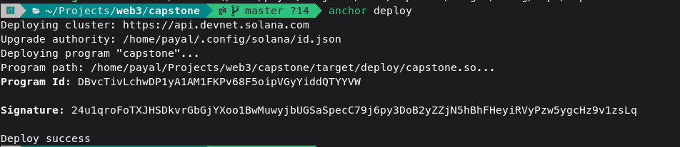

Proovz - A Decentralized Project Verification & Trust Score Protocol on Solana

# Overview
Proovz is a decentralized verification and attestation system built using Solana and Anchor.
It enables project registration, verifier whitelisting, trust scoring, attestations, and fair rewards distribution between admin and verifiers through a secure PDA-based treasury model.
This protocol ensures transparency, decentralization, and immutability in project validation.

# All test have been passed succesfully 


Deployed on devnet
Program Id :  DBvcTivLchwDP1yA1AM1FKPv68F5oipVGyYiddQTYYVW
Deployment Transaction Signature: 24u1qroFoTXJHSDkvrGbGjYXoo1BwMuwyjbUGSaSpecC79j6py3DoB2yZZjN5hBhFHeyiRVyPzw5ygcHz9v1zsLq


# Protocol Requirements
1. Project
 * Must pay a registration fee.
 * PDA derived using: ["project", owner, project_count].
 * Stores name, description, IPFS hash, owner, status, trust score.

2. Verifier
 * Must be added by admin to VerifierRegistry.
 * A verifier can attest a project only once.
 * Attestation PDA: ["attestation", project, verifier].

3. Treasury & Vault
 * Fees stored in vault PDA.
 * Fee split:
 * 40% → admin
 * 60% → verifiers
 * All transfers must use PDA signer seeds.

4. Withdrawals
 * Admin withdraw: can only withdraw admin_paid.
 * Verifier withdraw: gets proportional share based on attestation count.
 * Both withdrawals must be signed by the treasury_vault PDA.

5. Security
 * Strict access control:
 * Only admin can add verifiers.
 * Only project owner can update project.
 * Only whitelisted verifier can verify.
 * Only respective verifier can claim rewards.
 * Duplicate verification prevented.
 * PDAs must match correct seeds & bumps.

# Architecture Diagram (Conceptually)

  ```text
          +---------------------+                         
          |     Project Owner   |                         
          |  (register project) |                         
          +----------+----------+                         
                     |                                      
                     v                                      
    +-----------------------------------+             
    |            Project PDA            |             
    | (Name, Desc, Status, TrustScore)  |             
    | (Owner, project_id, bumps)        |             
    +----------------+------------------+             
                     |                                
                     v                                
       +--------------------------+                
       |    Verifier Registry PDA |                
       | (Whitelisted verifiers,  |                
       |  attestation counts)     |                
       +-------------+------------+                
                     |                                
       +-------------+-------------+                
       |                           |                
       v                           v                
+--------------+        +------------------------+  
|  Verifier A  |        |     Verifier B         |  
| (attest)     |        |     (attest)           |  
+-------+------+        +-----------+------------+  
        |                           |               
        v                           v               
+-----------------------------------------------+   
|              Attestation PDA(s)              |   
|  (proof a verifier voted on a project)       |   
|  (prevents duplicate verification)           |   
+----------------------+------------------------+   
                       |                            
                       v                            
            +--------------------------+             
            |       Treasury PDA       |             
            | (total_collected,        |             
            |  verifier_pool, admin)   |             
            +-------------+------------+             
                          |                            
                          v                            
            +--------------------------+             
            |      Vault PDA           |             
            |  (Holds lamports safely) |             
            |  (Signer for payouts)    |             
            +-------------+------------+             
                          |                            
         +----------------+------------------+        
         |                                   |        
         v                                   v        
+---------------------+            +----------------------+
|    Admin Wallet     |            |   Verifier Wallet    |
| (withdraw admin fee)|            | (withdraw rewards)   |
+---------------------+            +----------------------+
```


# Key features

 * Project Owner creates a Project PDA.
 * Verifiers are registered inside the Verifier Registry PDA.
 * When a verifier verifies a project, it creates an Attestation PDA.
 * Trust score and status update inside the Project PDA.
 * All registration fees collect into Treasury PDA → Vault PDA.
 * Admin can withdraw admin earnings.
 * Verifiers can withdraw pro-rata rewards.